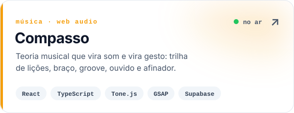
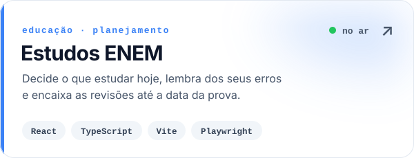
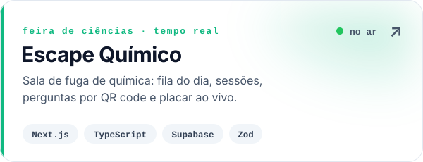
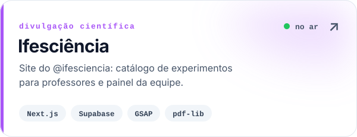

<picture>
  <source media="(prefers-color-scheme: dark)" srcset="assets/header-dark.svg">
  
</picture>

<p align="center">
  <a href="mailto:augustodonatelisimoes@gmail.com"></a>
  
  
</p>

---

## 👋 Sobre mim

Sou o **Guto**, desenvolvedor web e estudante de Informática no **Ifes**, em Cachoeiro de Itapemirim (ES).
Faço sites e automações para negócios da região e construo ferramentas que resolvem um problema de verdade:
de uma plataforma de estudos para o ENEM a uma sala de fuga de química com placar em tempo real.

```ts
const guto = {
  base: "Cachoeiro de Itapemirim, ES 🇧🇷",
  estuda: "Informática no Ifes",
  trabalhaCom: ["sites para negócios locais", "automação", "IA no WhatsApp"],
  stackFavorita: ["React", "TypeScript", "Next.js", "Supabase"],
  agora: "construindo a Aurora",
};
```

## 🚀 Construindo agora

> **Aurora**: uma recepcionista com inteligência artificial que atende o WhatsApp de pequenos negócios
> 24 horas por dia. Tira dúvidas, informa preços e horários e agenda sozinha, consultando a agenda do dono.
> Quando o assunto é sensível, passa para um humano.
>
> [**Conhecer a Aurora →**](https://aurora-landing-seven.vercel.app)

## 🧰 O que eu faço

<table>
  <tr>
    <td width="33%" valign="top">
      <h3>🌐 Sites</h3>
      Landing pages e sites para negócios locais: rápidos, bonitos no celular e fáceis de achar no Google.
    </td>
    <td width="33%" valign="top">
      <h3>⚙️ Automação</h3>
      Fluxos com n8n, integrações com WhatsApp e coleta de dados para tirar trabalho repetitivo do dia a dia.
    </td>
    <td width="33%" valign="top">
      <h3>📚 Educação</h3>
      Ferramentas interativas de estudo: guias, simuladores e plataformas que ensinam fazendo.
    </td>
  </tr>
</table>

## ⭐ Projetos em destaque

<table>
  <tr>
    <td width="50%" valign="top">
      <a href="https://github.com/AugustoDonateli/compasso">
        <picture>
          <source media="(prefers-color-scheme: dark)" srcset="assets/card-compasso-dark.svg">
          
        </picture>
      </a>
      <p align="center"><a href="https://compasso-gamma.vercel.app">🔗 acessar</a> · <a href="https://github.com/AugustoDonateli/compasso">📂 código</a></p>
    </td>
    <td width="50%" valign="top">
      <a href="https://github.com/AugustoDonateli/estudos-enem">
        <picture>
          <source media="(prefers-color-scheme: dark)" srcset="assets/card-enem-dark.svg">
          
        </picture>
      </a>
      <p align="center"><a href="https://estudos-enem-sooty.vercel.app">🔗 acessar</a> · <a href="https://github.com/AugustoDonateli/estudos-enem">📂 código</a></p>
    </td>
  </tr>
  <tr>
    <td width="50%" valign="top">
      <a href="https://github.com/AugustoDonateli/escape-quimico">
        <picture>
          <source media="(prefers-color-scheme: dark)" srcset="assets/card-escape-dark.svg">
          
        </picture>
      </a>
      <p align="center"><a href="https://escape-room-quimica.vercel.app">🔗 acessar</a> · <a href="https://github.com/AugustoDonateli/escape-quimico">📂 código</a></p>
    </td>
    <td width="50%" valign="top">
      <a href="https://github.com/AugustoDonateli/site-ifesciencia">
        <picture>
          <source media="(prefers-color-scheme: dark)" srcset="assets/card-ifesciencia-dark.svg">
          
        </picture>
      </a>
      <p align="center"><a href="https://site-ifesciencia.vercel.app">🔗 acessar</a> · <a href="https://github.com/AugustoDonateli/site-ifesciencia">📂 código</a></p>
    </td>
  </tr>
</table>

<details>
<summary><b>➕ Mais projetos</b></summary>
<br>

| Projeto | O que é |
|---|---|
| 🏀 [nba-do-zero](https://github.com/AugustoDonateli/nba-do-zero) | Guia interativo de basquete num único arquivo HTML, com jogadas animadas |
| ⌨️ [conceito-logitech-k950](https://github.com/AugustoDonateli/conceito-logitech-k950) | Landing de produto com vídeo controlado pela rolagem |
| 🌳 [biomap-campus](https://github.com/AugustoDonateli/biomap-campus) | Mapa interativo das plantas do campus, com filtros e estatísticas |
| 🗄️ [ifes-banco-de-dados](https://github.com/AugustoDonateli/ifes-banco-de-dados) | Consultas avançadas em SQL com PostgreSQL rodando no navegador |
| 🔬 [ifes-guia-biologia](https://github.com/AugustoDonateli/ifes-guia-biologia) | Guias de estudo interativos para as provas práticas de Biologia |

</details>

## 🛠️ Stack

<p>
  <b>Front-end</b><br><br>
  
</p>
<p>
  <b>Back-end e dados</b><br><br>
  
</p>
<p>
  <b>Ferramentas</b><br><br>
  
</p>
<p>
  
  
  
  
  
</p>

## 🐍 Atividade

<picture>
  <source media="(prefers-color-scheme: dark)" srcset="https://raw.githubusercontent.com/AugustoDonateli/AugustoDonateli/output/github-snake-dark.svg">
  
</picture>

## 📫 Contato

Tem um projeto, um negócio que precisa de site ou quer trocar uma ideia?
Me chama em **[augustodonatelisimoes@gmail.com](mailto:augustodonatelisimoes@gmail.com)**.
