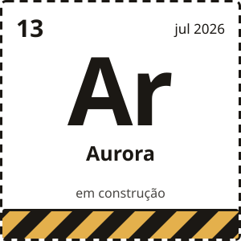
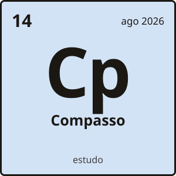
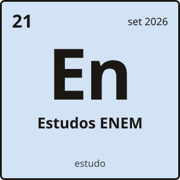
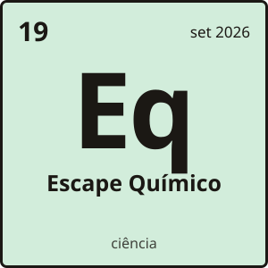
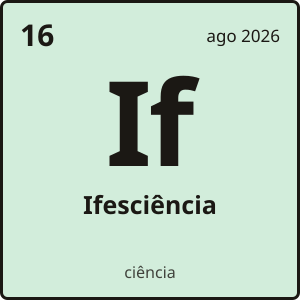
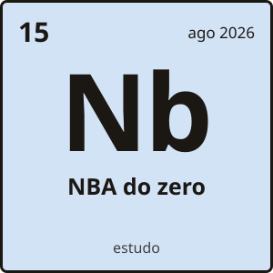
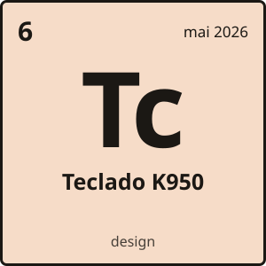

<picture>
  <source media="(prefers-color-scheme: dark)" srcset="assets/cabecalho-escuro.svg">
  
</picture>

Estudo Informática no Ifes e faço software para gente de verdade: o site do projeto de divulgação científica da escola, a sala de fuga de química da feira de ciências, uma plataforma de estudos para o ENEM e sites para comércio aqui de Cachoeiro, a capital secreta do mundo.

Ligo para o detalhe que quase ninguém repara. No Compasso, o ícone da aba pulsa como um metrônomo.

## Agora

<picture><source media="(prefers-color-scheme: dark)" srcset="assets/ficha-aurora-escuro.svg"></picture>

- Construindo a **[Aurora](https://aurora-landing-seven.vercel.app)**, uma recepcionista com IA que atende o WhatsApp de pequenos negócios. Ela tira dúvida, passa preço e marca horário sozinha, olhando a agenda do dono.
- Gravando vídeos para o [@ifesciencia](https://www.instagram.com/ifesciencia/), o projeto de divulgação científica do Ifes.
- Escolhendo o projeto que vou levar para a Jacitec, a mostra científica do campus.

 

## Coisas que eu fiz

  <a href="https://github.com/AugustoDonateli/compasso"><picture><source media="(prefers-color-scheme: dark)" srcset="assets/ficha-compasso-escuro.svg"></picture></a>
  <a href="https://github.com/AugustoDonateli/estudos-enem"><picture><source media="(prefers-color-scheme: dark)" srcset="assets/ficha-enem-escuro.svg"></picture></a>
  <a href="https://github.com/AugustoDonateli/escape-quimico"><picture><source media="(prefers-color-scheme: dark)" srcset="assets/ficha-escape-escuro.svg"></picture></a>
  <a href="https://github.com/AugustoDonateli/site-ifesciencia"><picture><source media="(prefers-color-scheme: dark)" srcset="assets/ficha-ifesciencia-escuro.svg"></picture></a>
  <a href="https://github.com/AugustoDonateli/nba-do-zero"><picture><source media="(prefers-color-scheme: dark)" srcset="assets/ficha-nba-escuro.svg"></picture></a>
  <a href="https://github.com/AugustoDonateli/conceito-logitech-k950"><picture><source media="(prefers-color-scheme: dark)" srcset="assets/ficha-teclado-escuro.svg"></picture></a>

O número de cada ficha é a ordem em que o repositório nasceu na minha conta. A cor é a família: azul para estudo, verde para ciência, laranja para design.

**[Compasso](https://github.com/AugustoDonateli/compasso).** Teoria musical que vira som. Você clica numa escala, ela acende no braço do violão e toca. O menu é o quarto de um músico, e cada instrumento abre uma ferramenta. No ar em [compasso-gamma.vercel.app](https://compasso-gamma.vercel.app).

**[Estudos ENEM](https://github.com/AugustoDonateli/estudos-enem).** Uma plataforma de preparação para o ENEM feita sob medida para um aluno. Ela decide o que estudar no dia, guarda cada erro como um conceito para revisar e encaixa as revisões até a data da prova. No ar em [estudos-enem-sooty.vercel.app](https://estudos-enem-sooty.vercel.app).

**[Escape Químico](https://github.com/AugustoDonateli/escape-quimico).** O sistema da sala de fuga de química que a minha turma montou para a feira de ciências. Organiza a fila, conduz cada sessão, entrega as perguntas pelos QR codes das estações e mostra o placar ao vivo.

**[Ifesciência](https://github.com/AugustoDonateli/site-ifesciencia).** O site do @ifesciencia. Cada vídeo vira uma ficha que um professor consegue reproduzir em sala, com material, passo a passo e PDF, e a equipe publica sem precisar de programador.

**[NBA do zero](https://github.com/AugustoDonateli/nba-do-zero).** Um guia de basquete num arquivo HTML só. Serve para quem não sabe nada entender a NBA e ainda melhorar a tática do time com jogadas animadas.

**[Teclado K950](https://github.com/AugustoDonateli/conceito-logitech-k950).** Estudo de página de produto em que o vídeo do teclado avança conforme você rola. Projeto de estudo, sem ligação com a marca.

## O espectro do meu ano

<picture>
  <source media="(prefers-color-scheme: dark)" srcset="assets/espectro-escuro.svg">
  
</picture>

Cada risco é um dia no GitHub, e quanto mais claro, mais eu programei. O desenho se refaz sozinho toda madrugada.

## Com o que eu trabalho

No dia a dia: TypeScript, React, Next.js e Supabase. Quando o projeto pede, também Tailwind, GSAP, Tone.js, PostgreSQL, Cloudflare Workers, Playwright e automações no n8n.

## Fora do teclado

- Toco bateria há poucos meses. A meta é tocar *Everlong* inteira.
- Jogo basquete e ainda estou tentando enterrar.
- Pesco tucunaré sempre que dá.
- Tenho uma impressora 3D que imprime peça para metade dos meus amigos.
- Sou escoteiro desde os 7 anos.

## Fala comigo

Tem um projeto, um negócio que precisa de site ou quer só trocar uma ideia? Me manda um e-mail em [augustodonatelisimoes@gmail.com](mailto:augustodonatelisimoes@gmail.com).

As artes desta página são desenhadas por código, com as fontes embutidas. Está tudo em [`scripts/`](scripts).
