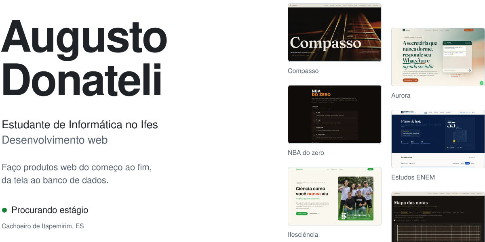
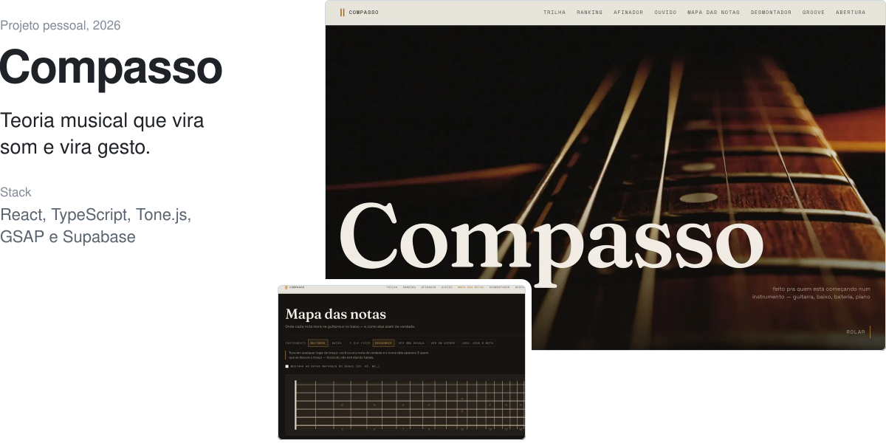
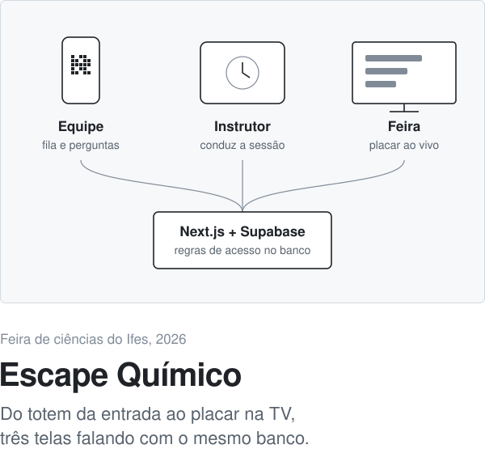
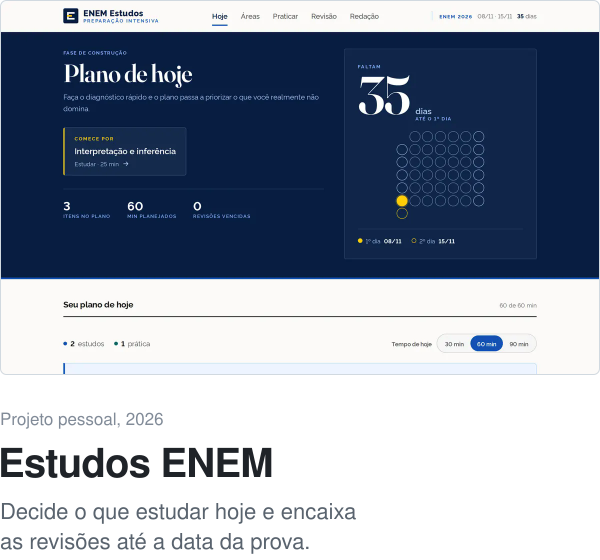
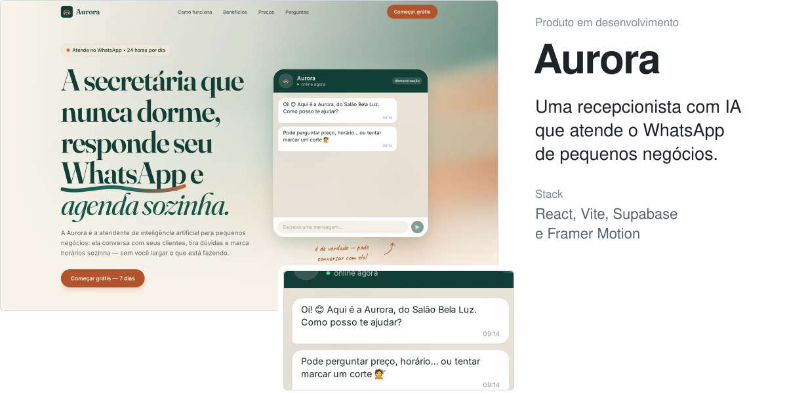
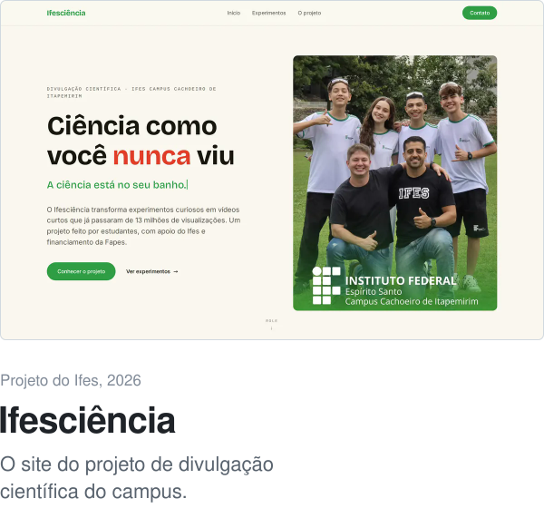
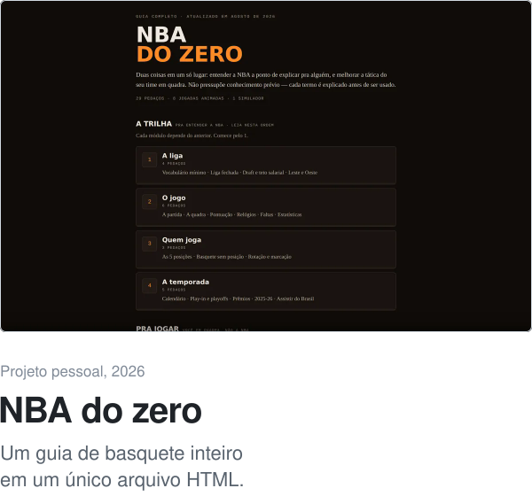
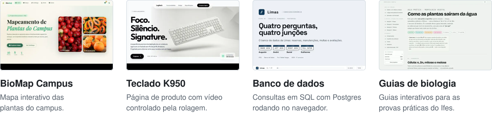
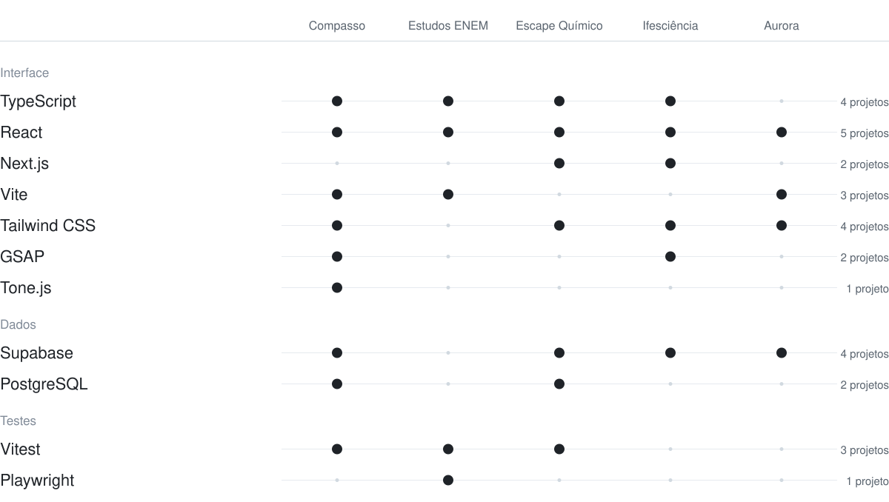

<picture>
  <source media="(prefers-color-scheme: dark)" srcset="assets/abertura-escuro.svg">
  
</picture>

<a href="mailto:augustodonatelisimoes@gmail.com">augustodonatelisimoes@gmail.com</a>

 

## Agora

<picture>
  <source media="(prefers-color-scheme: dark)" srcset="assets/agora-escuro.svg">
  
</picture>

 

## Projetos

<a href="https://github.com/AugustoDonateli/compasso">
<picture>
  <source media="(prefers-color-scheme: dark)" srcset="assets/compasso-escuro.svg">
  
</picture>
</a>

Feito para quem está começando num instrumento: cada conceito de teoria toca na hora e aparece no braço do violão. O motor de teoria musical é próprio e tem testes. 
[Código](https://github.com/AugustoDonateli/compasso)

 

<table>
<tr>
<td width="50%" valign="top">
<a href="https://github.com/AugustoDonateli/escape-quimico">
<picture>
  <source media="(prefers-color-scheme: dark)" srcset="assets/escape-escuro.svg">
  
</picture>
</a>

Organiza a fila do dia, conduz cada sessão, entrega as perguntas pelos QR codes das estações e mostra o placar ao vivo. Feito para a sala de fuga que a minha turma montou.

<a href="https://github.com/AugustoDonateli/escape-quimico">Código</a>

</td>
<td width="50%" valign="top">
<a href="https://github.com/AugustoDonateli/estudos-enem">
<picture>
  <source media="(prefers-color-scheme: dark)" srcset="assets/enem-escuro.svg">
  
</picture>
</a>

Diagnostica, prioriza, monta o plano do dia e guarda cada erro como um conceito para revisar. Tem testes de ponta a ponta com Playwright.

<a href="https://github.com/AugustoDonateli/estudos-enem">Código</a>

</td>
</tr>
</table>

 

<a href="https://aurora-landing-seven.vercel.app">
<picture>
  <source media="(prefers-color-scheme: dark)" srcset="assets/aurora-escuro.svg">
  
</picture>
</a>

Atende clientes no WhatsApp: tira dúvidas, passa preços e marca horários olhando a agenda do dono. Quando o assunto é sensível, passa a conversa para uma pessoa. O código é privado. 
[Site](https://aurora-landing-seven.vercel.app)

 

<table>
<tr>
<td width="50%" valign="top">
<a href="https://github.com/AugustoDonateli/site-ifesciencia">
<picture>
  <source media="(prefers-color-scheme: dark)" srcset="assets/ifesciencia-escuro.svg">
  
</picture>
</a>

Cada vídeo do projeto vira uma ficha que um professor consegue reproduzir em sala, e a equipe publica sem precisar de programador.

<a href="https://site-ifesciencia.vercel.app">Site</a> &nbsp; <a href="https://github.com/AugustoDonateli/site-ifesciencia">Código</a>

</td>
<td width="50%" valign="top">
<a href="https://github.com/AugustoDonateli/nba-do-zero">
<picture>
  <source media="(prefers-color-scheme: dark)" srcset="assets/nba-escuro.svg">
  
</picture>
</a>

Explica a NBA para quem não sabe nada e ajuda a melhorar a tática do time com jogadas animadas. Sem build e sem dependências.

<a href="https://augustodonateli.github.io/nba-do-zero/">Site</a> &nbsp; <a href="https://github.com/AugustoDonateli/nba-do-zero">Código</a>

</td>
</tr>
</table>

 

#### Projetos menores

<picture>
  <source media="(prefers-color-scheme: dark)" srcset="assets/tambem-escuro.svg">
  
</picture>

[BioMap Campus](https://github.com/AugustoDonateli/biomap-campus) &nbsp;·&nbsp; [Teclado K950](https://github.com/AugustoDonateli/conceito-logitech-k950) &nbsp;·&nbsp; [Banco de dados](https://github.com/AugustoDonateli/ifes-banco-de-dados) &nbsp;·&nbsp; [Guias de biologia](https://github.com/AugustoDonateli/ifes-guia-biologia)

 

## Com o que eu trabalho

<picture>
  <source media="(prefers-color-scheme: dark)" srcset="assets/stack-escuro.svg">
  
</picture>

Cada ponto é um projeto em que a tecnologia foi usada de verdade. Fora desses, uso n8n para automações e Cloudflare Workers em um projeto privado.

 

## Sobre mim

Sou estudante de Informática no Ifes, em Cachoeiro de Itapemirim. Gosto de construir coisas que alguém vai usar: a sala de fuga da feira de ciências, o site do projeto de divulgação científica da escola, um app para quem está aprendendo música.

O que mais me interessa é o meio do caminho entre tecnologia, produto e experiência: entender o problema, desenhar a tela e fazer funcionar. Faço parte do [@ifesciencia](https://www.instagram.com/ifesciencia/) e, sempre que dá, transformo matéria de escola em ferramenta.

Para falar comigo: [augustodonatelisimoes@gmail.com](mailto:augustodonatelisimoes@gmail.com)
