<picture>
  <source media="(prefers-color-scheme: dark)" srcset="assets/banner-escuro.svg">
  
</picture>

Estudo Informática no Ifes e trabalho principalmente com **TypeScript, React, Next.js e Supabase**. Estou em busca de uma oportunidade de **estágio em desenvolvimento**.

Hoje desenvolvo a **[Aurora](https://aurora-landing-seven.vercel.app)**, um sistema de atendimento com inteligência artificial que responde clientes e agenda horários pelo WhatsApp para pequenos negócios. Também faço sites e sistemas sob medida para empresas da região.

**Em destaque**

- **[Escape Químico](https://github.com/AugustoDonateli/escape-quimico):** plataforma em tempo real para a sala de fuga da feira de ciências do Ifes. Next.js, Supabase.
- **[Compasso](https://github.com/AugustoDonateli/compasso):** aplicação de teoria musical com áudio gerado no navegador. React, Tone.js.
- **[Estudos ENEM](https://github.com/AugustoDonateli/estudos-enem):** planejador de estudos com repetição espaçada e testes automatizados. React, Playwright.

**Contato:** [augustodonatelisimoes@gmail.com](mailto:augustodonatelisimoes@gmail.com)
